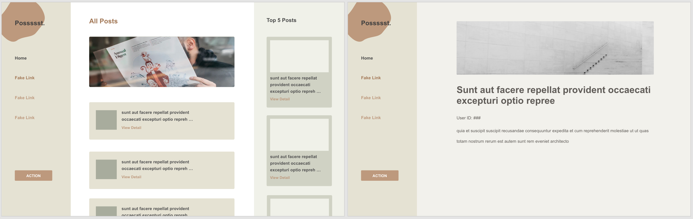

# JavaScript Demo Project

## Run the project locally
- click "clone or download" on upper right corner
- choose "Clone" and copy the link
- run `git clone {link_you_copied}` in your terminal
- After project succesfully cloned, cd to the project and run `npm install` to install required dependencies for this project.

## To Run Project
- run `npm start` to start the project